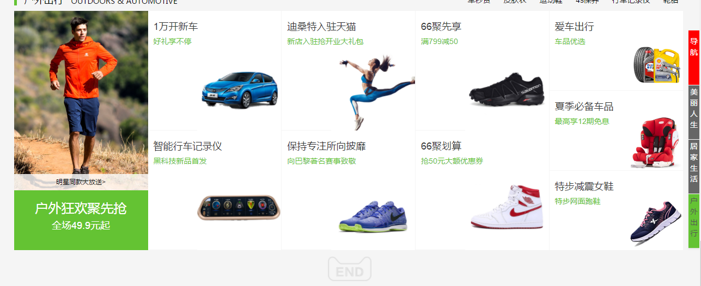

# TMall
This is my final project--imitate 'TMall'  webpage.

## 项目成员
王议莹 2015210405038

## 项目描述
模仿天猫前端主页的若干部分

## 页面设计
### 天猫主页

## 功能模块
### 使用Bootstr、JQuery实现前端页面的交互功能
#### 1.总导航的背景图片轮播效果

#### 2.热门品牌部分，鼠标移动到相应项目上时，产生幕布动画效果

#### 3.分类导航部分的图片移动交互

#### 4.分类导航部分的附加导航Affix效果

## 技术架构
### 前端页面
HTML CSS JS

Bootstrap JQuery jsrender less

### 数据存储
JSON

### 幻灯片(myslide)
HTML CSS JS

reveal.js MarkDown

